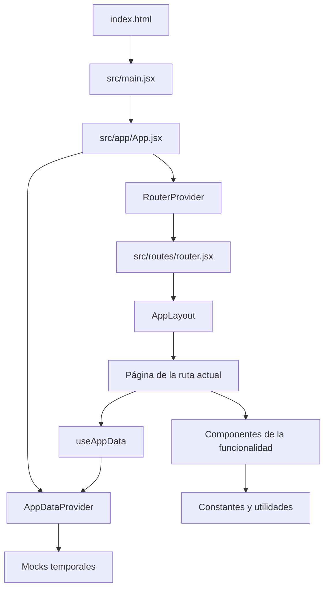

# Guía de lectura del frontend

Esta guía explica cómo recorrer el frontend de **Gestor documental** sin intentar
memorizar todos sus archivos. El objetivo es aprender a reconocer la estructura,
seguir el recorrido de los datos y encontrar rápidamente dónde se implementa cada
comportamiento.

El proyecto está construido con React, React Router, JavaScript, Vite y CSS Modules.
En esta etapa todavía no existe comunicación con un backend: los datos se cargan
desde `src/mocks` y se mantienen temporalmente en memoria mediante
`AppDataProvider`.

## 1. El mapa mental más importante

Cuando el navegador abre la aplicación, el recorrido general es este:



La forma corta de recordarlo es:

> Entrada → aplicación → proveedor de datos y rutas → layout → página → componentes
> → utilidades → actualización de datos → nuevo render.

## 2. Orden recomendado de lectura

No leas todo de arriba abajo ni en orden alfabético. Haz varias pasadas, cada una
con una pregunta concreta.

### Primera pasada: cómo arranca

Lee estos archivos en este orden:

1. [`package.json`](./package.json)
   - Indica las dependencias y los comandos disponibles.
   - `react` construye la interfaz.
   - `react-router` decide qué pantalla mostrar.
   - `vite` ejecuta y compila el proyecto.
   - `eslint` revisa reglas y errores de código.

2. [`index.html`](./index.html)
   - Contiene el elemento HTML con `id="root"`.
   - React utilizará ese elemento como punto de montaje.

3. [`src/main.jsx`](./src/main.jsx)
   - Importa React, `createRoot`, el componente `App` y los estilos globales.
   - Busca `#root` en el HTML y renderiza `<App />`.
   - `StrictMode` ayuda a detectar problemas durante el desarrollo. En modo de
     desarrollo puede ejecutar ciertos procesos más de una vez intencionalmente.

4. [`src/app/App.jsx`](./src/app/App.jsx)
   - Es pequeño, pero explica toda la arquitectura.
   - `AppDataProvider` envuelve la aplicación y comparte los datos.
   - `RouterProvider` muestra la página correspondiente a la URL.

Después de esta pasada debes poder responder: **¿dónde empieza React y qué dos
sistemas principales envuelven la aplicación?**

### Segunda pasada: rutas y estructura visual

5. [`src/routes/router.jsx`](./src/routes/router.jsx)
   - Funciona como el índice de pantallas.
   - Relaciona cada URL con una página.
   - Los segmentos como `:matterId` y `:matterTypeId` son parámetros dinámicos.

| URL | Página principal | Propósito |
| --- | --- | --- |
| `/matters` | `MattersPage` | Listar y filtrar matters |
| `/matters/new` | `NewMatterPage` | Crear un matter |
| `/matters/:matterId` | `MatterDetailPage` | Control documental y estado |
| `/matters/:matterId/edit` | `EditMatterPage` | Editar número o matter type |
| `/admin/matter-types` | `MatterTypesPage` | Administrar tipos |
| `/admin/templates` | `TemplatesPage` | Consultar plantillas |
| `/admin/templates/:matterTypeId` | `TemplateDetailPage` | Administrar secciones y documentos |
| `/admin/users` | `UsersPage` | Administrar usuarios |

6. [`src/layouts/AppLayout.jsx`](./src/layouts/AppLayout.jsx)
   - Contiene el menú, la identidad temporal y el área principal.
   - `<Outlet />` es el lugar donde React Router inserta la página activa.
   - También contiene el comportamiento responsive del menú y su navegación por
     teclado.

Después de esta pasada debes poder responder: **¿cómo encuentra React la página de
una URL y dónde se coloca dentro del diseño general?**

### Tercera pasada: de dónde salen los datos

Lee estos tres archivos en orden:

7. [`src/app/providers/AppDataContext.js`](./src/app/providers/AppDataContext.js)
   - Crea el contexto, es decir, el canal por el que viajarán los datos compartidos.

8. [`src/app/providers/useAppData.js`](./src/app/providers/useAppData.js)
   - Es el hook que utilizan las páginas para acceder al contexto.
   - Evita que cada componente tenga que importar directamente el contexto.

9. [`src/app/providers/AppDataProvider.jsx`](./src/app/providers/AppDataProvider.jsx)
   - Actualmente representa una combinación provisional de base de datos y backend.
   - Es el archivo más grande; no intentes memorizarlo.

Para leer `AppDataProvider`, divídelo en bloques:

1. Funciones `createInitial...`: transforman los mocks en el estado inicial.
2. `createMatterSnapshot` (importada desde `synchronizeMatterTemplate.js`): crea documentos y secciones vinculados mediante identificadores estables.
3. Declaraciones `useState`: un estado agrupa matter types, matters y registros para sincronizarlos juntos; los usuarios tienen su propio estado.
4. Funciones de matters: crear, editar y guardar el control documental.
5. Funciones de matter types.
6. Funciones de documentos y secciones de plantillas.
7. Funciones de usuarios.
8. Objeto `value`: enumera todo lo que los demás componentes pueden consumir.

Los datos iniciales están temporalmente en:

- [`src/mocks/matters.js`](./src/mocks/matters.js)
- [`src/mocks/matterDetails.js`](./src/mocks/matterDetails.js)
- [`src/mocks/matterTypes.js`](./src/mocks/matterTypes.js)
- [`src/mocks/users.js`](./src/mocks/users.js)

Un cambio realizado en el navegador modifica el estado de React, no esos archivos.
Por eso actualmente los cambios desaparecen al recargar la página.

Después de esta pasada debes poder responder: **¿qué archivo posee los datos, cómo
los obtiene una página y por qué se reinician al actualizar?**

## 3. Sigue una funcionalidad completa

La mejor forma de entender un proyecto grande es seguir una acción desde la URL
hasta el lugar donde se modifican los datos.

### Ejemplo A: crear un matter

1. `router.jsx` relaciona `/matters/new` con `NewMatterPage`.
2. [`NewMatterPage.jsx`](./src/features/matters/pages/NewMatterPage.jsx) obtiene
   `matterTypes`, `matters` y `createMatter` mediante `useAppData()`.
3. La página entrega datos y una función `onSubmit` a
   [`MatterForm.jsx`](./src/features/matters/components/MatterForm.jsx).
4. `MatterForm` controla los campos, valida el número de seis dígitos y muestra
   `DocumentTemplatePreview`.
5. Al enviar el formulario, llama el callback recibido por props.
6. `NewMatterPage` llama `createMatter` del proveedor.
7. `AppDataProvider` crea el matter y su lista inicial vinculada a la plantilla.
8. La página navega al detalle del nuevo matter.

Este patrón aparece muchas veces:

> La página conecta los datos; el formulario controla la entrada; el proveedor
> ejecuta la operación; React vuelve a renderizar.

### Ejemplo B: actualizar un documento

1. La URL `/matters/:matterId` abre
   [`MatterDetailPage.jsx`](./src/features/matters/pages/MatterDetailPage.jsx).
2. `useParams()` obtiene el identificador de la URL.
3. `useAppData()` permite buscar el matter y su registro.
4. La página copia los documentos a estado local para permitir cambios sin guardar.
5. [`DocumentChecklist.jsx`](./src/features/documents/components/DocumentChecklist.jsx)
   recibe los documentos y `onDocumentChange` mediante props.
6. Al cambiar estado, cantidad o comentario, el checklist llama ese callback.
7. `MatterDetailPage` recalcula el estado automático y marca cambios pendientes.
8. El botón **Save changes** llama `saveMatterChanges` del proveedor.

Observa la diferencia entre:

- **Estado local:** cambios que todavía no se han guardado.
- **Estado compartido:** información guardada durante la sesión en el proveedor.
- **Estado derivado:** valores calculados, como porcentaje y estado automático.

## 4. Cómo están organizadas las funcionalidades

Dentro de `src/features`, cada carpeta representa un área del producto:

| Carpeta | Responsabilidad |
| --- | --- |
| `matters` | Lista, creación, edición, detalle y flujo del matter |
| `documents` | Estados y checklist de documentos |
| `matterTypes` | Catálogo de tipos y reglas para saber si están configurados |
| `templates` | Secciones y documentos requeridos por cada tipo |
| `users` | Listado, creación y edición de usuarios |

Dentro de una funcionalidad encontrarás normalmente:

- `pages/`: componentes asociados directamente con una ruta.
- `components/`: piezas reutilizadas por las páginas.
- `constants/`: listas fijas de valores permitidos.
- `utils/`: funciones de validación, normalización o cálculo.
- `*.module.css`: estilos privados del componente con el mismo nombre.

Una **page** conoce la URL y el proveedor. Un **component** debería concentrarse en
la interfaz y comunicarse mediante props. Una **util** no renderiza nada: recibe
datos y devuelve un resultado.

## 5. Orden para estudiar cada área

### Matters

1. `MattersPage.jsx`: listado, búsqueda y filtros.
2. `NewMatterPage.jsx`: conexión entre el formulario y el proveedor.
3. `MatterForm.jsx`: campos, validaciones y vista previa.
4. `MatterDetailPage.jsx`: flujo documental y estados.
5. `DocumentChecklist.jsx`: edición de cada documento.
6. `calculateMatterStatus.js`: reglas automáticas del workflow.
7. `matterStatuses.js` y `documentStatuses.js`: valores permitidos.
8. `EditMatterPage.jsx` y `MatterEditForm.jsx`: reemplazo administrativo de la
   plantilla del matter.

### Matter types y templates

1. `MatterTypesPage.jsx`: catálogo administrativo.
2. `MatterTypeForm.jsx`: creación y edición del nombre y descripción.
3. `TemplatesPage.jsx`: acceso a las plantillas.
4. `TemplateDetailPage.jsx`: administración de secciones y documentos.
5. `TemplateSectionForm.jsx`: validación de secciones.
6. `TemplateDocumentForm.jsx`: configuración de un documento.
7. `matterTypeTemplateStatus.js`: decide si la plantilla puede utilizarse.
8. `groupDocumentsBySection.js`: construye los grupos visuales.

### Users

1. `UsersPage.jsx`.
2. `NewUserPage.jsx` y `EditUserPage.jsx`.
3. `UserForm.jsx`.
4. `userValidation.js`.

## 6. Cómo leer los imports de un archivo

Los imports explican las dependencias antes de leer el componente. En este proyecto
suelen aparecer en este orden:

1. React: `useState`, `useMemo`, `useEffect`, etc.
2. React Router: `Link`, `useNavigate`, `useParams`, etc.
3. Datos compartidos: `useAppData`.
4. Componentes comunes: botones, encabezados, diálogos.
5. Componentes de la funcionalidad.
6. Constantes y utilidades.
7. CSS Module.

Cuando abras un archivo desconocido, traduce primero sus imports a una frase. Por
ejemplo:

> “Esta página utiliza estado local, lee un parámetro de la URL, obtiene datos
> compartidos, presenta un checklist y calcula el estado del matter”.

Esa frase te dice qué buscar antes de leer el JSX completo.

## 7. Método para leer un componente React

Busca sus partes en este orden:

1. **Imports:** qué necesita el archivo.
2. **Props:** qué información recibe desde su padre.
3. **Estado:** busca `useState`.
4. **Datos calculados:** variables, filtros, `useMemo`.
5. **Handlers:** funciones que comienzan normalmente con `handle`.
6. **Return:** estructura que se muestra en pantalla.
7. **CSS Module:** léelo al final, cuando ya sepas qué elemento estiliza cada clase.

No necesitas entender cada línea en la primera pasada. Marca primero:

- de dónde viene la información;
- quién puede modificarla;
- qué función se ejecuta al hacer clic;
- dónde termina guardándose.

## 8. Patrones importantes del proyecto

### Componentes controlados

Los formularios guardan sus campos en `useState`. El valor del input viene de React
y `onChange` actualiza React.

### Props y callbacks

Un componente hijo recibe datos y funciones. En vez de modificar el estado del padre
directamente, ejecuta el callback que recibió.

### Normalización antes de comparar

Las funciones `normalize...` eliminan diferencias irrelevantes de espacios o
mayúsculas antes de buscar duplicados.

### Plantilla vinculada y seguimiento independiente

Al crear un matter se generan documentos y secciones con `templateDocumentId` y
`templateSectionId`. Estos identificadores permiten actualizar sus definiciones
sin confundir documentos que se renombran ni perder su seguimiento.

La plantilla controla nombre, descripción, documento clave, cantidad esperada,
sección y orden. El matter conserva estado, cantidad recibida, comentario,
usuario y fecha de actualización del seguimiento. No se busca por nombre al sincronizar.

Si un requisito desaparece de la plantilla, pasa a `previousDocuments` y se muestra
en **Previous requirements**, sin contar en avance ni estado automático. Crear
otro requisito con el mismo nombre genera un registro nuevo; no recupera por
error el seguimiento anterior. Quitar una sección mueve sus documentos a General.

`applyTemplateChanges` actualiza plantilla, registros y estados en una única
operación de estado de React. Solo recalcula matters en modo Automatic; respeta
Manual incluso en Accepted y Sent. Un cambio automático queda fechado en el historial.

Esto no cambia la acción administrativa de elegir **otro matter type**, que sigue
reemplazando la lista y reiniciando el seguimiento después de confirmarlo.

### CSS Modules

Una importación como:

```js
import styles from './MatterForm.module.css'
```

permite usar `className={styles.form}` sin crear nombres de clase globales que puedan
chocar con otros componentes.

## 9. Sistema de estilos

Lee los estilos generales en este orden:

1. [`src/styles/tokens.css`](./src/styles/tokens.css): colores, sombras, radios y
   variables reutilizables.
2. [`src/styles/reset.css`](./src/styles/reset.css): elimina diferencias básicas
   entre navegadores.
3. [`src/styles/global.css`](./src/styles/global.css): tipografía, fondo y enfoque.
4. `*.module.css`: estilos específicos de cada componente.

Si deseas cambiar un color utilizado en muchas pantallas, busca primero si existe
como variable en `tokens.css`. Si el cambio afecta una sola pantalla, modifica su
CSS Module.

## 10. Qué cambiará cuando exista el backend

Los mocks y el estado temporal no deben borrarse al comenzar el backend. Primero se
construirá y comprobará cada endpoint; después se sustituirá gradualmente la fuente
de datos del frontend.

La transición prevista es:

1. Mantener los mocks mientras se diseña la base de datos y la API.
2. Crear una capa de servicios para realizar solicitudes HTTP.
3. Incorporar estados de carga, éxito y error.
4. Reemplazar una operación temporal a la vez.
5. Comparar que el comportamiento nuevo sea equivalente.
6. Eliminar mocks y operaciones provisionales solamente cuando ya no tengan ningún
   consumidor.

`AppDataProvider` cambiará considerablemente: dejará de ser una base de datos en
memoria y coordinará la información recibida desde el backend. Las páginas y los
componentes visuales deberían necesitar menos modificaciones porque ya están
separados de los datos mediante `useAppData` y callbacks.

## 11. Rutina práctica para incorporarte a un proyecto grande

Cuando entres a un código desconocido, utiliza esta lista:

1. Identifica framework, comandos y dependencias.
2. Encuentra el punto de entrada.
3. Encuentra rutas y layout.
4. Localiza el estado global y las llamadas externas.
5. Escoge una acción visible y síguela de punta a punta.
6. Lee primero páginas y luego sus componentes.
7. Deja estilos y detalles auxiliares para la segunda pasada.
8. Haz un pequeño diagrama del flujo de datos.
9. Confirma tus conclusiones ejecutando la aplicación.
10. Repite el proceso con otra funcionalidad.

El objetivo no es memorizar el repositorio. Es construir un mapa que te permita
responder rápidamente: **dónde empieza algo, quién lo controla, qué modifica y dónde
se guarda**.

## 12. Comandos útiles durante la lectura

```bash
npm run dev
npm run lint
npm test
npm run build
```

- `dev`: abre el entorno de desarrollo.
- `lint`: detecta errores y patrones problemáticos.
- `test`: comprueba las reglas de seguimiento y el contenido del informe sin instalar otra biblioteca de pruebas.
- `build`: confirma que el proyecto puede compilarse para despliegue.

Realiza cambios pequeños, comprueba la pantalla afectada y revisa el diff antes de
continuar. Esa disciplina hace que aprender un proyecto grande sea mucho más
controlable.

## 13. Cómo leer los últimos cambios: número, sincronización e impresión

### Número del matter

Lee `src/features/matters/utils/normalizeMatterName.js`, luego `MatterForm.jsx`
y `MatterEditForm.jsx`. La expresión `^[0-9]{6}$` acepta exactamente seis dígitos.
El valor sigue almacenado en `matterName` como texto para conservar ceros iniciales
como `001234`; la interfaz lo llama **Matter number**. No se cortan números largos
ni se eliminan letras automáticamente. Solo se recortan espacios exteriores.
La validación se repite en el proveedor, no únicamente en los formularios.

### Sincronización de una plantilla

Sigue esta secuencia concreta:

1. Una página de templates llama una operación de `AppDataProvider`.
2. Esa operación usa `setMatterTypes` para producir la nueva plantilla.
3. `setMatterTypes` llama `applyTemplateChanges` en
   `src/features/matters/utils/synchronizeMatterTemplate.js`.
4. La utilidad encuentra los matters del tipo modificado y llama
   `synchronizeMatterRecord` para cada registro.
5. Relaciona documentos por `templateDocumentId`, reemplaza definiciones y conserva
   los campos de seguimiento. Los documentos nuevos empiezan en Pending.
6. Los eliminados pasan a `previousDocuments`, junto con su sección anterior y la
   fecha de retirada. Una cantidad recibida también se conserva si la plantilla
   desactiva el conteo; la interfaz la muestra como cantidad registrada anteriormente.
7. Solo en modo Automatic se calcula el nuevo estado y, si cambia, se agrega historial.
8. React recibe el catálogo, los registros y los matters actualizados juntos.

El inicializador de mocks ahora construye cada lista desde su plantilla real de
ejemplo, en lugar de dar la misma lista genérica a todos los tipos. Esto permite
probar relaciones e identificadores coherentes desde el primer render.

### Informe de impresión

Empieza en `src/features/matters/pages/MatterDetailPage.jsx`: pasa los documentos
del estado **local**, no una copia antigua guardada. Por eso el informe refleja lo
que estás viendo e indica **Unsaved changes included** si corresponde.

Después lee, en orden:

1. `src/features/matters/hooks/useMatterPrint.js`: abre la impresión del navegador
   y actualiza la fecha mediante `beforeprint`, también al usar el atajo del navegador.
2. `src/features/matters/components/MatterPrintReport.jsx`: construye cabecera,
   conteos, secciones y requisitos anteriores.
3. `src/features/documents/utils/documentReport.js`: cuenta cada estado por separado
   y da formato a cantidades y fechas. «Resuelto» no se confunde con «Recibido».
4. `src/features/documents/components/DocumentSummaryTable.jsx`: tabla de solo
   lectura reutilizada en el informe y en Previous requirements.
5. Los CSS Modules de ambos componentes: estilos de pantalla e impresión.

El informe usa un **portal**: React lo coloca junto a `#root`, directamente dentro
del body. Está oculto en pantalla. Al imprimir, las reglas `@media print` muestran
solo el informe, sin menú ni controles. No depende de los acordeones del checklist,
por lo que las secciones cerradas también aparecen. No genera ni almacena un PDF
por su cuenta: puedes escoger «Guardar como PDF» en el navegador.

### Pruebas que también sirven como ejemplos de lectura

- `tests/matterTracking.test.mjs`: validación, vínculo con plantillas, conservación
  de datos, archivo, cantidades, estados manuales/automáticos y coherencia de mocks.
- `tests/matterReport.test.mjs`: renderiza el componente real para comprobar listas,
  conteos, comentarios, datos sin guardar y archivo. No comprueba visualmente la
  paginación de una impresora; esa parte se revisa en la vista previa del navegador.

El comando `npm test` utiliza el ejecutor de pruebas incluido en Node 24. Lee el
nombre de una prueba, prepara mentalmente sus datos iniciales y observa qué cambio
hace y qué resultado espera. Es una forma rápida de aprender las reglas del sistema.

### Inventario de archivos de este bloque

- **Estado compartido:** `src/app/providers/AppDataProvider.jsx` ahora coordina la
  sincronización y valida números. Los nuevos identificadores usan `crypto.randomUUID()`.
- **Reglas de matters:** `normalizeMatterName.js` valida los seis dígitos;
  `synchronizeMatterTemplate.js` crea y sincroniza listas; `calculateMatterStatus.js`
  evita declarar listo un matter con plantilla vacía o sin documentos clave.
- **Creación y edición:** `MatterForm.jsx`, `MatterEditForm.jsx`, `NewMatterPage.jsx`,
  `EditMatterPage.jsx` y `MattersPage.jsx` actualizan campos, errores, búsqueda y etiquetas.
  `DocumentTemplatePreview.jsx` explica el vínculo con la plantilla.
- **Detalle:** `MatterDetailPage.jsx` incorpora impresión, requisitos anteriores,
  motivo del cambio automático y protección contra dividir por cero en el avance;
  `MatterDetailPage.module.css` permite acomodar el nuevo botón.
- **Checklist:** `src/features/documents/components/DocumentChecklist.jsx` muestra
  cantidades históricas al desactivar el conteo y un mensaje para listas vacías.
- **Informe y antecedentes:** `MatterPrintReport.jsx` y su CSS, `useMatterPrint.js`,
  `DocumentSummaryTable.jsx` y su CSS, y `documentReport.js` son nuevos.
- **Mensajes de templates:** `TemplatesPage.jsx`, `TemplateDetailPage.jsx`,
  `NewTemplateDocumentPage.jsx` y `EditTemplateDocumentPage.jsx` explican que los
  cambios se aplican a matters existentes y que las eliminaciones conservan antecedentes.
- **Datos de ejemplo:** `src/mocks/matters.js` usa números de seis dígitos;
  `src/mocks/matterDetails.js` conserva ejemplos de seguimiento sobre la plantilla correcta.
- **Pruebas y configuración:** `tests/matterTracking.test.mjs` y
  `tests/matterReport.test.mjs` son nuevos; `package.json` añade `npm test` y
  `eslint.config.js` incluye los archivos de prueba. No se añadieron dependencias.
- **Documentación:** esta guía actualiza las reglas anteriores y explica el recorrido
  de lectura de los archivos nuevos.
